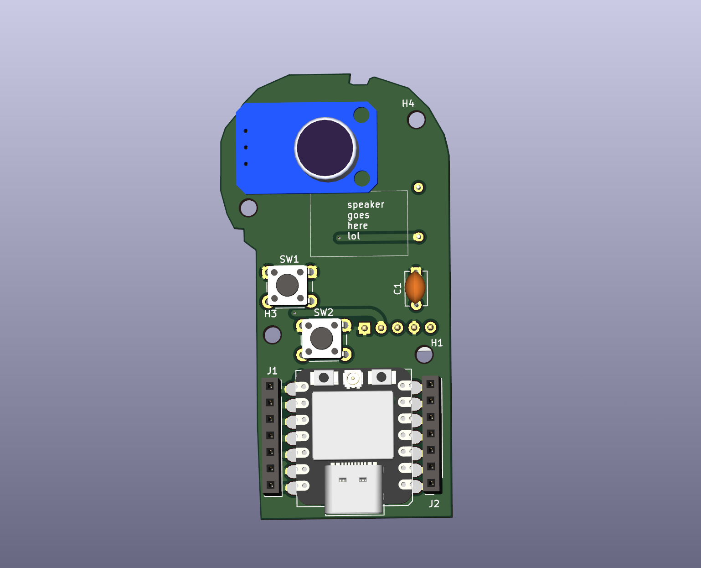
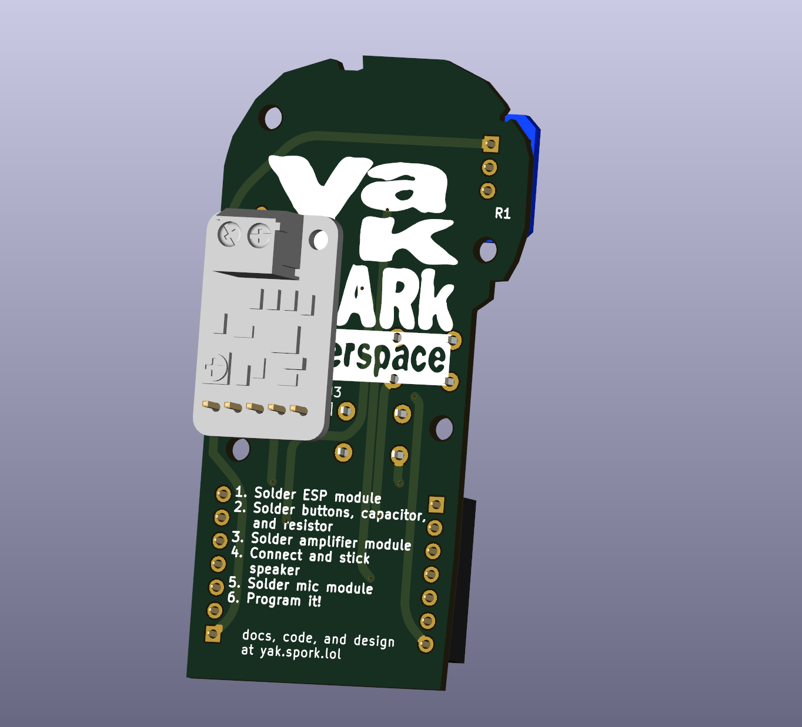
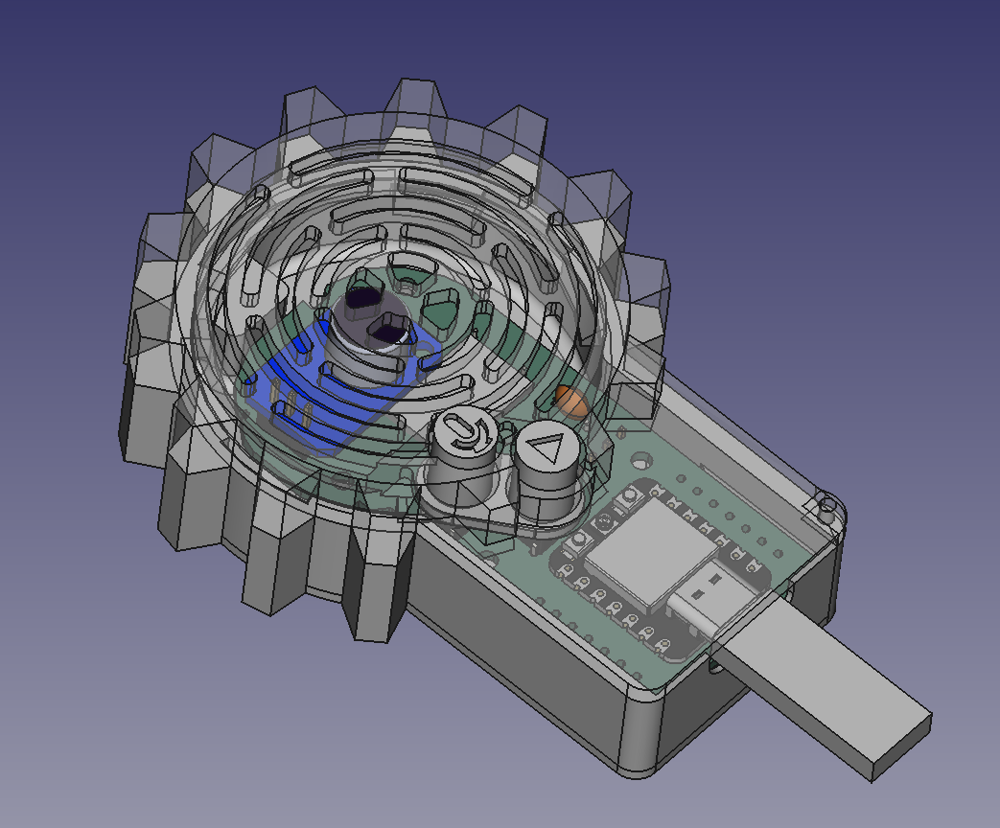

## About
This project is intended to act as a short introduction to soldering, as well as to act as a platform for exploring audio inputs/outputs with Arduino.

## Components
* Seeed Studio XIAO ESP32C3 ([source](https://www.seeedstudio.com/Seeed-XIAO-ESP32C3-p-5431.html))
* Electret Microphone Amp Module (or clone)
* Adafruit 2130 - PAM8302 (or clone)
* 10Ω resistor (THT)
* 100nf ceramic capacitor
* 8Ω 0.5W Speaker ([source](https://www.harfington.com/products/p-1077007?currency=USD&variant=42125198622969&utm_medium=cpc&utm_source=google&utm_campaign=Google%20Shopping&srsltid=AfAwrE5xj9HOdhrmCOGlX5rFUivPkEOZYhoFlpFoKg4NeLDqNTXnyzFJOVI))

## Assembly

## PCB
The PCB for this project was designed in KiCAD 7.

## Code
Download this repository and open the [software](https://github.com/SparkMakerspace/YakBak-soldering-kit/tree/main/software/test%20software) directory to find the firmware source. The firmware is intended to be modified and flashed with [PlatformIO](https://platformio.org/).

## Enclosure
The YakSpark enclosure is intended to be 3D printed and was designed in FreeCAD. Source, STEP, and STL files are found in the [enclosure](https://github.com/SparkMakerspace/YakBak-soldering-kit/tree/main/enclosure) directory. 
